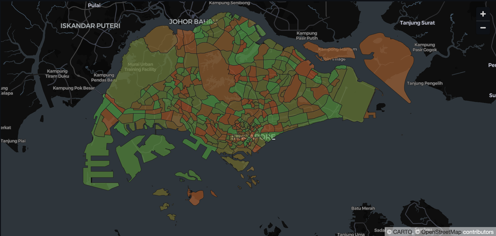

# Singapore Flood Risk Map

Interactive Streamlit project to visualize Singapore weather/flood signals by subzone and estimate short-term flood risk using a rule-based proxy model (until annotated labels are available).

[](https://singapore-flood-risk.streamlit.app/)
[](#quick-start)

## Live App
- Streamlit: **https://singapore-flood-risk.streamlit.app/**

## App Preview
> Add your screenshot here: `assets/app-preview.png`



## What This Project Does
- Displays Singapore subzones on an interactive map.
- Lets you inspect **single features** one by one (rainfall, humidity, lightning, forecast, etc.).
- Shows a **combined flood-risk layer** computed from a configurable proxy formula.
- Supports:
  - **Historical Replay** (timestamp slider)
  - **Live API Snapshot** (real-time pull from data.gov.sg)
- Provides a dashboard with metrics, charts, and ranked risk tables.

## Why A Proxy Model
Flood labels are currently limited/non-annotated for supervised training.  
So the current prediction is a transparent formula combining last-1h weather context:
- rainfall accumulation (15/60 min)
- humidity
- lightning activity
- 2-hour forecast signal
- ongoing flood-alert pressure

This design is intentional so the UI/data pipeline can be production-ready while a true ML model is prepared.

## Architecture
1. **Ingestion**
- Pull data from data.gov.sg weather/flood APIs.
- Build timestamped subzone features (`subzone + timestamp_5min`).

2. **Feature Layer**
- Weather + forecast + event indicators normalized per timestamp.

3. **Risk Layer**
- Rule-based risk scoring (`0..1`) with configurable weights.

4. **Visualization**
- Streamlit + PyDeck choropleth map.
- Metrics/charts/tables under the map.

## Quick Start
```bash
# 1) Create environment
python -m venv .venv
source .venv/bin/activate

# 2) Install deps
pip install streamlit pydeck pandas requests

# 3) Add your API key
# .env -> api-key=...

# 4) Add local boundary + feature files (not versioned)
# data/MasterPlan2019SubzoneBoundaryNoSeaGEOJSON.geojson
# data/processed/subzone_weather_features.csv

# 5) Run app
streamlit run app.py
```

## Data Policy
This repository is configured to **not commit datasets**.
Ignored by default:
- `data/raw/`
- `data/raw_v2/`
- `data/processed/`
- `data/*.csv`
- `data/*.geojson`
- `data/*.json`
- `data/*.parquet`
- `.env`

## Repository Structure
```text
.
├── app.py
├── scripts/
│   ├── build_dataset_from_datagov.py
│   ├── build_processed_features_fast.py
│   └── build_rainfall_history.py
├── data/
│   └── .gitkeep
└── assets/
    ├── .gitkeep
    └── app-preview.png   # add manually
```

## Next Milestones
- Train supervised flood model once sufficient labeled events are available.
- Add calibration + backtesting dashboard.
- Add uncertainty band per subzone risk score.

---
Maintained by [juliennigou](https://github.com/juliennigou)
